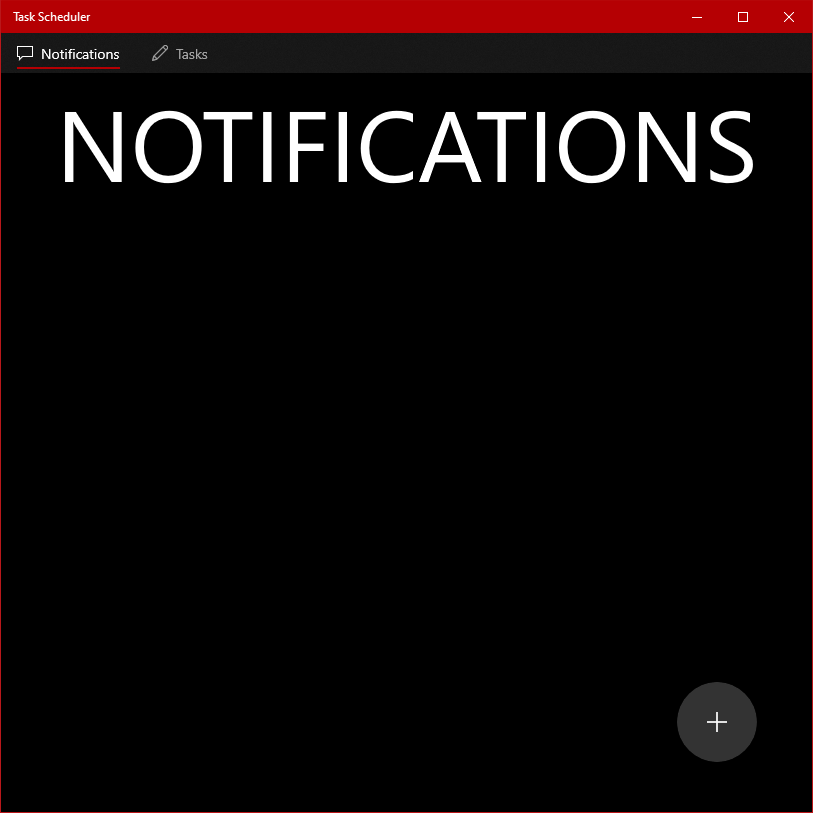
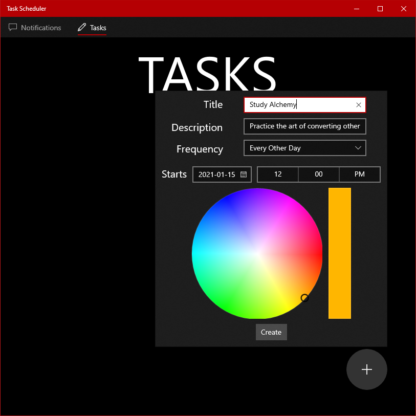
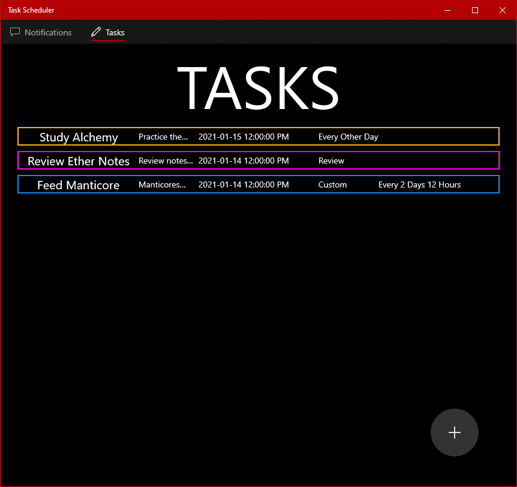

# Task Scheduler
*work in progress*

## What
An application that allows scheduling tasks that produce periodic notifications.

The user will be able to
- Create a new Task
- Delete a Task
- View the details of a Task
- Edit a Task
- View all Tasks
- View all Notifications generated by Tasks
- View a Task's details from a Notification it generated
- Dismiss Notifications

## Why
So one does not have to remember for themselves to do things on a certain periodic basis. For example, if one wants to remember to study a subject every day, one can schedule a task called "Study X" with a daily notification frequency then the app will generate a notification every day reminding them of the task.

## Status
So far, the application has the following functionality:
- Users can create Tasks
- Users can view all their Tasks on the Tasks page
- Tasks are saved between application sessions

